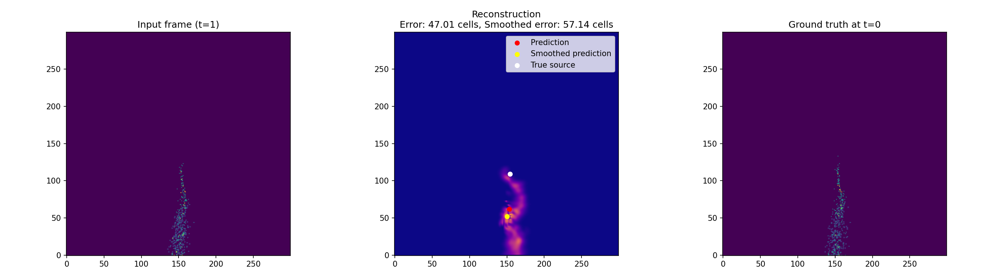
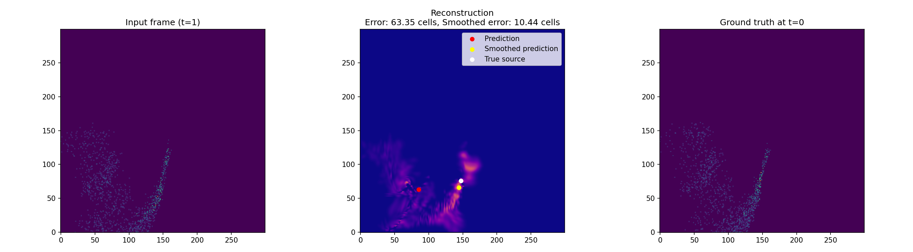

# Exp 001 — Baseline for the Source Finding Task

## Overview
This experiment defines a baseline setup for evaluating source localization accuracy using transport-model-derived data.

The goal of this baseline is to provide a clear reference point for future improvements (new features, model architectures, post-processing, smoothing strategies, etc.).

## Folder Contents
- `run_baseline.py` — script used to run the baseline evaluation.
- `predictions.csv` — predictions and/or intermediate experiment outputs.
- `plots/` — visualizations of key error metrics.
- `README.md` — this file.

## Key Final Metrics
Across all processed files, the following aggregate results were obtained:

- **Mean error across all files:** `25.2388` cells
- **Mean smoothed error across all files:** `21.7954` cells

### Interpretation
- Smoothing reduces the average source localization error.
- Absolute improvement: **3.4434 cells**.
- Relative improvement: **≈13.64%** compared to the raw estimate.

## Key Result Visualizations
The plots below (from `plots/`) summarize error behavior in the baseline scenario.

### Maximum Error (raw)

### Maximum Error (smoothed)

### Improvement from Smoothing

### Minimum Error (raw)

### Minimum Error (smoothed)

## How to Run
From the project root:

1. Ensure dependencies are installed (the project uses Poetry).
2. Run the baseline experiment script.

Example:
- `poetry run python experiments/exp_001_baseline/run_baseline.py`

[//]: # (## What to Compare Against This Baseline)

[//]: # (Use these same metrics for all follow-up experiments:)

[//]: # (- Mean error across all files)

[//]: # (- Mean smoothed error across all files)

[//]: # (- Absolute and relative improvement from smoothing)

[//]: # ()
[//]: # (This keeps comparisons between `exp_001_baseline` and later experiment versions consistent and transparent.)
